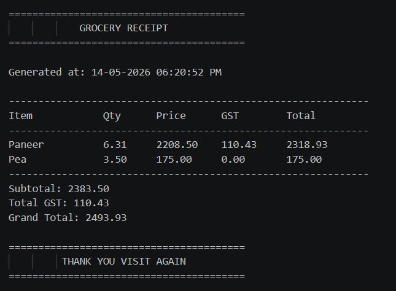

# Shop Management System using C

A simple yet powerful console-based Shop Management / Billing System built completely in C.

This project is focused on simulating a real-world grocery billing software inside the terminal using concepts of:
- Structures
- Functions
- Arrays
- Dynamic Memory Allocation
- File Handling
- String Handling
- GST Calculation
- Receipt Generation
- Modular Programming

The project is still under active development and will continue receiving improvements, optimizations, and additional functionality over time.

---

# Preview

## Generated Receipt



---

# Features

- Product listing with IDs and prices
- Quantity-based billing
- Automatic GST calculation
- Different GST slabs for different products
- Dynamic receipt generation
- Receipt history saving
- File handling using `fopen()`, `fprintf()`, etc.
- Formatted terminal output
- Timestamp-based billing records
- Input validation for invalid product IDs
- Modular and structured codebase

---

# Technologies Used

- C Programming Language
- GCC Compiler
- Standard C Libraries:
  - stdio.h
  - string.h
  - stdlib.h
  - time.h

---

# Project Structure

```bash
Shop Bill Management System/
│
├── data/
│   └── receipt_history.txt
│
├── demo_generated_reciept.png
├── main.c
├── main.exe
└── README.md
```

---

# How To Clone This Repository

## Using HTTPS

```bash
git clone https://github.com/CodesByAyushShivam/Shop-Management-System-using-C-.git

## Using SSH

```bash
git clone git@github.com:CodesByAyushShivam/Shop-Management-System-using-C-.git

---

# Navigate To Project Folder

```bash
cd "Shop-Management-System-using-C-"

# How To Compile The Project

> **Make sure GCC is installed on your system.**
Compile using:
```bash
gcc main.c -o main

# How To Run The Project

1. On Windows
    ```bash
    .\main

2. On Linux / macOS
    ```bash
    ./main

---

# How It Works

1. User enters the number of products
2. User selects product IDs
3. Quantity is entered
4. GST is automatically applied based on product type
5. Total bill is calculated
6. A formatted receipt is generated dynamically
7. Receipt gets stored inside:
    ```bash
    data/receipt_history.txt

---

# Concepts Used

This project demonstrates practical implementation of:
- Structures in C
- Arrays of structures
- Functions
- Switch cases
- Dynamic memory allocation (malloc)
- String formatting using sprintf
- File handling
- Date & time formatting using strftime
- Input validation
- Console UI formatting

---

# Current Status

The project is actively being improved and optimized continuously with time.
More refinements, better optimizations, and additional functionality will keep being added in future updates.

---

# Internal Working

The complete workflow of the project follows a structured billing pipeline.

## Workflow Overview

```text
User Input
    ↓
Product Validation
    ↓
Fetch Product Details
    ↓
Price Calculation
    ↓
GST Calculation
    ↓
Store Data Inside Struct
    ↓
Generate Receipt
    ↓
Display Receipt
    ↓
Save Receipt History
```

The program dynamically processes all items entered by the user and generates a formatted receipt using runtime-generated strings.

---

# Structure Used

The project uses a custom structure to store all billing-related information for every product.

```c
struct item {
    float unitPrice;
    float price;
    char name[20];
    int id;
    float quant;
    int gstRate;
    float gstAmount;
};
```

## Purpose of Each Field

| Field | Purpose |
|---|---|
| `unitPrice` | Price of a single unit of the product |
| `price` | Total price before GST |
| `name` | Product name |
| `id` | Product ID |
| `quant` | Quantity entered by user |
| `gstRate` | GST percentage applied |
| `gstAmount` | Calculated GST amount |

The program stores every product entry inside an array of structures:

```c
struct item list[n];
```

This allows handling multiple billing items dynamically.

---

# Function Breakdown

## `printList()`

Displays all available products with their IDs and prices.

### Purpose
- Helps users choose products
- Works like a mini product catalog

---

## `getNamebyId(int id)`

Returns the product name based on product ID.

### Example

```c
getNamebyId(3);
```

### Returns

```text
Paneer
```

---

## `getPricebyId(int id)`

Returns unit price of a product using its ID.

### Example

```c
getPricebyId(4);
```

### Returns

```text
50.00
```

---

## `price(int id, float quant)`

Calculates total price before GST.

### Formula Used

```text
quantity × unit price
```

### Example

```text
6 × 50 = 300
```

---

## `gstrate(int id)`

Returns GST percentage according to product type.

### Current GST Logic

| Product Type | GST |
|---|---|
| Basic food products | 0% |
| Paneer / Milk Powder | 5% |
| Ice Cream | 18% |

---

## `calGst(float price, int rate)`

Calculates GST amount.

### Formula Used

```text
(price × GST rate) / 100
```

---

## `generateReceipt(struct item list[], int n)`

The core function of the project.

### Responsibilities
- Dynamically creates the complete receipt
- Formats billing table
- Calculates:
  - subtotal
  - total GST
  - grand total
- Generates timestamp
- Returns receipt as dynamically allocated string

The function internally uses:
- `malloc()`
- `sprintf()`
- `strftime()`

to generate the final formatted receipt.

---

# Dynamic Memory Allocation

The receipt is generated dynamically using:

```c
malloc()
```

This allows the receipt size to be flexible during runtime.

```c
char *receipt = (char*) malloc(5000 * sizeof(char));
```

The generated receipt must later be released using:

```c
free(receipt);
```

to avoid memory leaks.

---

# File Handling

The project stores all generated receipts inside:

```text
data/receipt_history.txt
```

## File Mode Used

```c
fopen("receipt_history.txt", "a");
```

### Why Append Mode?

Append mode (`"a"`) ensures:
- Previous receipts are preserved
- New receipts are added at the end
- Billing history remains persistent

The generated receipt string is saved using:

```c
fprintf(file, "%s", receipt);
```

---

# Receipt Generation Logic

The receipt formatting uses:

```c
sprintf()
```

to append formatted text into a single large string buffer.

Example:

```c
sprintf(receipt + len, "Grand Total: %.2f\n", grandTotal);
```

This approach allows:
- dynamic receipt creation
- reusable receipt generation
- easy file saving
- clean terminal formatting

---

# Time & Date Handling

The project uses:

```c
time()
localtime()
strftime()
```

to generate human-readable timestamps.

### Example Output

```text
14-05-2026 06:20:52 PM
```

This timestamp gets attached to every generated receipt.

---

# Input Validation

The project validates product IDs before processing.

### Example

```c
if(list[i].id < 1 || list[i].id > 7)
```

This prevents:
- invalid product selection
- undefined behavior
- incorrect billing

Invalid inputs force the user to re-enter valid product IDs.

---


# AI Usage in This Project

AI assistance has been minimally used in this project.

The complete project architecture, billing logic, product handling, GST system, file handling, validation logic, struct design, workflow management, and overall implementation have been written manually.

AI was only used for generating the logic of the following function:

```c
//AI Generated Receipt generation logic based on passed arguments and available data in struct item list[]
char *generateReceipt(struct item list[], int n)
```

The above function was generated with the help of:

```text
OpenAI GPT-5.5
```

After generation, the logic was manually integrated, tested, modified, debugged, and optimized according to the project requirements.

All remaining code in this project has been manually written and structured.

---

# Suggestions & Contributions

Suggestions, corrections, improvements, and feedback are always welcome.

Feel free to contact:
[📧 ayushshivam7245@gmail.com](mailto:ayushshivam7245@gmail.com)

---

# Support The Project

If you liked this project, consider giving the repository a ⭐ on GitHub.
It really helps and motivates further development.

---

<h2 align="center">👨‍💻 Author</h2>

<p align="center">
```diff
  Made with ❤️ in C by 
  <a href="https://github.com/your-username"><b>Ayush Shivam</b></a>
```
</p>